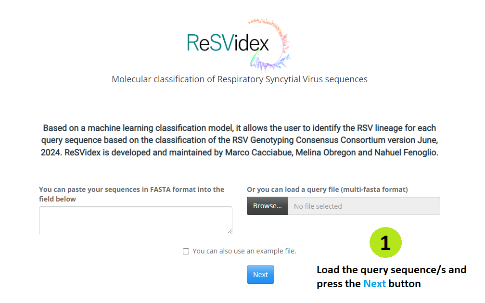
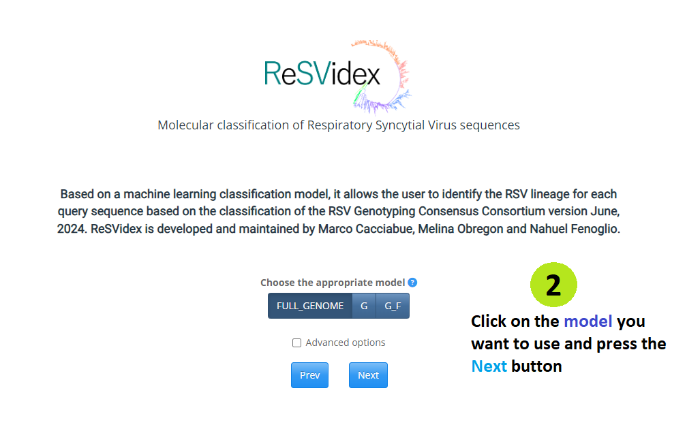

```{r, include = FALSE}
knitr::opts_chunk$set(
  collapse = TRUE,
  comment = "#>",
  dpi=300,
  out.width = "100%"
)
app_name <- "ReSVidex"
```

## The app offers the easiest way to use the **`r app_name `** package. Just follow the next steps:

```{r out.width = '100%', echo = FALSE}


knitr::include_graphics("vignette_3.png")
knitr::include_graphics("vignette_4.png")
knitr::include_graphics("vignette_5.png")
```

