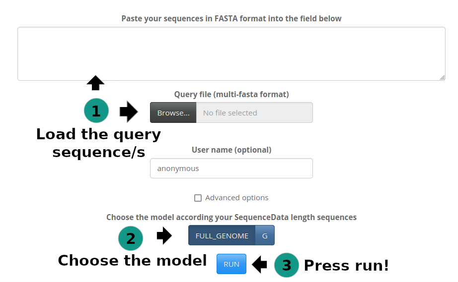
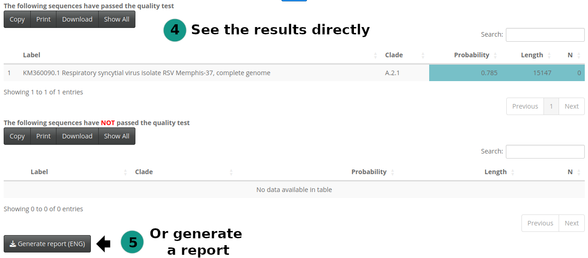
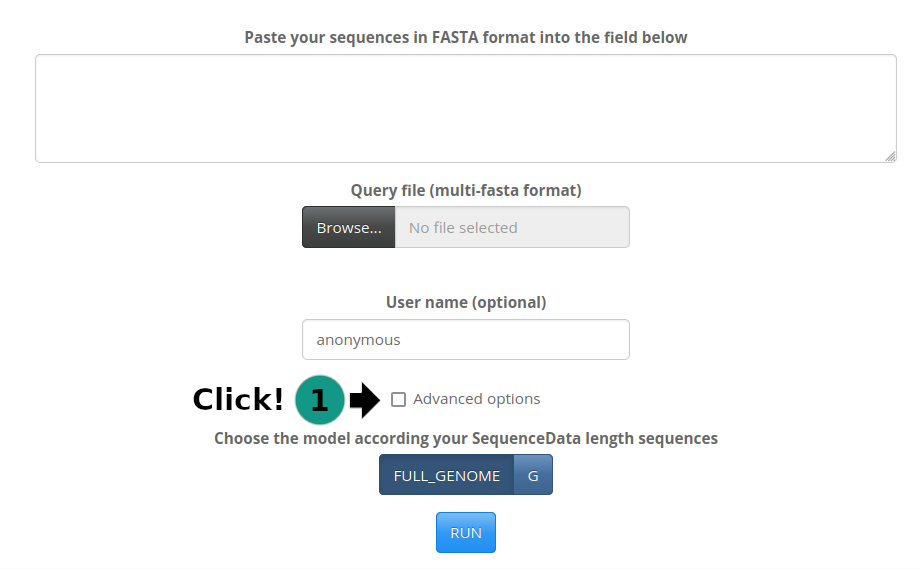
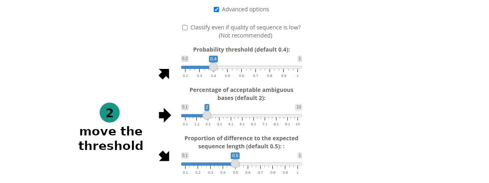

```{r, include = FALSE}
knitr::opts_chunk$set(
  collapse = TRUE,
  comment = "#>",
  dpi=300,
  out.width = "100%"
)
app_name <- "ReSVidex"
```

## The app offers the easiest way to use the **`r app_name `** package. Just follow the next steps:

```{r out.width = '100%', echo = FALSE}


```

## There is an extra step, if you want to change the parameters of the quality test:

```{r out.width = '100%', echo = FALSE}


```

## But what do this options mean?:

* With the **probability threshold** you can choose the minimum chance of likelihood to one of the lineages of the classification model. Not recommended below 0.2.
* You can set what percentage of the bases of the sequence are allowed to be left as **ambiguous**. Not recommended below 10%.
* You can also change how much difference there is in **proportion** to the more probable sequence from the model. Not recommended below 10%
* Finally, there is the option to classify even if your sequence is low quality, if you tick the **"classify even..."** option, above the parameters explained before.
