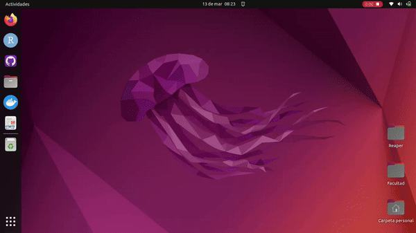
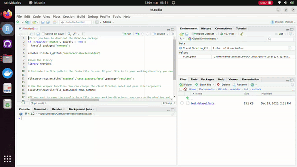
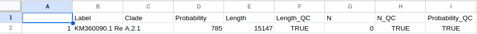

```{r, include = FALSE}
knitr::opts_chunk$set(
  collapse = TRUE,
  comment = "#>"
)
app_name <- "ReSVidex"
```

First of all, if you don't have **R** go to (https://www.r-project.org/) to download and know more about **R**. Then go to (https://posit.co/download/rstudio-desktop/) to download **Rstudio**, an integrated development environment (IDE) that makes more easier the usage of R.

**You don't need to learn how to use R, because here you have a...**

## Step by step on how to use **`r app_name `** with **R**


### 1. Open Rstudio and create a script

```{r out.width = '100%', echo = FALSE}

```


### 2. Copy the following script and run all the lines

```
#First you have to download the ReSVidex package
if (!require("remotes", quietly = TRUE))
  install.packages("remotes")
  
remotes::install_github("marcocacciabue/resvidex")

#load the library
library(resvidex)

# Indicate the file path to the fasta file to use. If your file is in your working directory you need to simply indicate the file name. In this case, we use a test file provided with the package itself. 

file_path<-system.file("extdata","test_dataset.fasta",package="resvidex")

# Use the wrapper function. You can change the classification model and pass other arguments
classify(inputFile=file_path,model=FULL_GENOME)

#If you want to save the results in a file in your working directory, you can run the pipeline and
#save it as a variable to export
Classification_Print<-classify(inputFile=file_path,model=FULL_GENOME)
utils::write.csv2(Classification_Print,"Classification_file.csv")
```

```{r out.width = '100%', echo = FALSE}

```

Then to see the results you can open the .cvs file saved in you working directory with any excel type program.

**Here is the result:**

```{r out.width = '100%', echo = FALSE}

```


