```{r, include = FALSE}
knitr::opts_chunk$set(
  collapse = TRUE,
  comment = "#>"
)
```

I downloaded a fasta file with multiple sequences of RSV virus from (https://www.ncbi.nlm.nih.gov/).

## Let's see how ReSVidex runs this dataset:

First I created a new R script and set the folder where the fasta is saved, as the working directory

```{r out.width = '100%', echo = FALSE}

```

Loaded the ReSVidex library

```
library(resvidex)
```

Loaded the name of the fasta file, in this case "data_set.fasta"

```
file<-"RSV_900_sequences.fasta"
```

Used the classification function from the ReSVidex package and saved it

```
Classification_Print<-classify(inputFile=file, model=FULL_GENOME)
```

Visualized on the console the dataframe created by the function writing "Classification_1" on the script and running the line (i could instead write the line in the console itself)

```{r out.width = '100%', echo = FALSE}
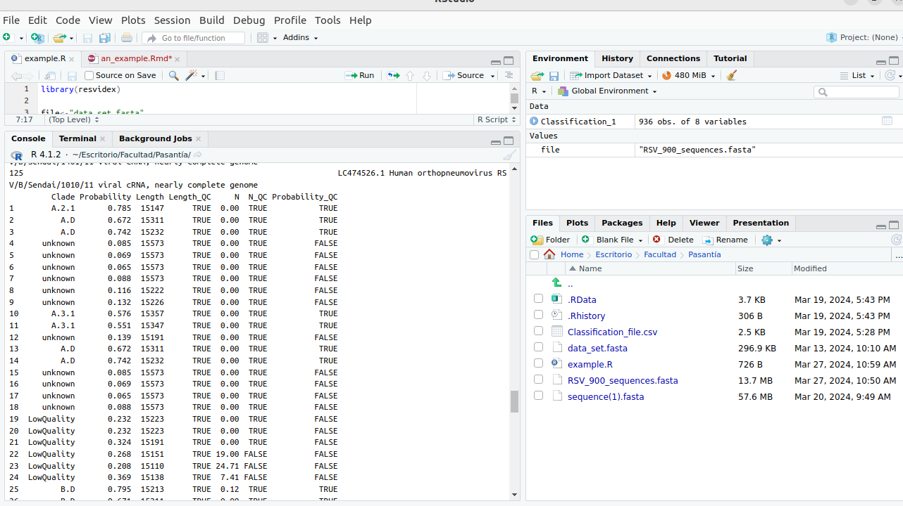
```

Saved the results as a cvs file to open with an excel type program. This file is always saved in the same folder set as working directory

```
utils::write.csv2(Classification_1,"Classification_1.csv")
```

```{r out.width = '100%', echo = FALSE}
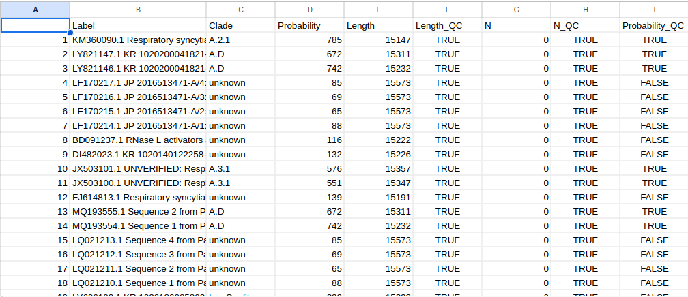
```

But as you can see, such a long list is hard to read, so... we could make some **GRAPHICS**!!

First let's install and load the **ggplot2** package, a very useful package made for making any type of graphics

```
install.package("ggplot2")

library (ggplot2)
```

We could make a bar graphic that shows us how many sequences passed the probability check

```
plot1<-ggplot(data = Classification_1,
             aes(x=Probability_QC))+
             labs(x="Passed probability check",
                    y="Sequences")+
  geom_bar()
plot1
```
And that would look like this

```{r out.width = '100%', echo = FALSE}
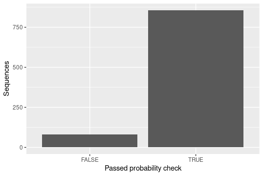
```

Or we could see how many sequences are per clade

```
plot2<-ggplot(data = Classification_1,
              aes(x=Clade))+
  theme(axis.text.x = element_text(angle = 45, hjust = 1))+
  geom_bar()
```

```{r out.width = '100%', echo = FALSE}
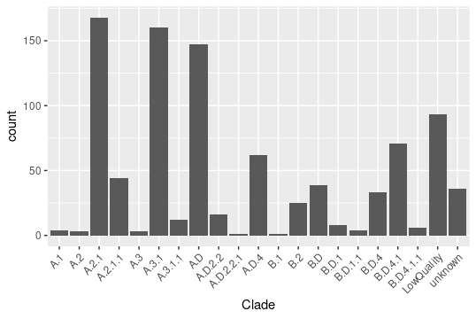
```

If you want to give some colors to the graphs you could rewrite the plot like this

```
col<-"#7AC5CD"
col2<-"#FF8C00"

plot1<-ggplot(data = Classification_1,
             aes(x=Probability_QC, group=Probability_QC))+
             labs(x="Passed probability check",
                  y="Sequences")+
             theme(legend.position="none")+
  scale_fill_manual(values = c(col2, col))+
  geom_bar(aes(fill=Probability_QC))

plot2<-ggplot(data = Classification_1,
              aes(x=Clade))+
  theme(axis.text.x = element_text(angle = 45, hjust = 1))+ 
  scale_colour_gradientn(colours = c(col,col2))+
  theme(legend.position="none")+
  geom_bar(aes(fill=Clade))
```

And it would look like this

```{r out.width = '40%', echo = FALSE}
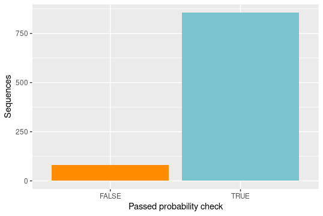
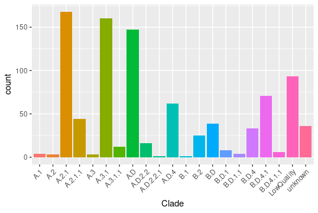

```


**But there's more... we could change some parameters...**

The function classify has some predetermined parameters values that we can change

```
classify(inputFile=file,
        model=FULL_GENOME,
        QC_value=0.4,
        Length_value=0.5,
        N_value=2)
```

For example we'll use the same dataset, but with a lower probability QC_value. The line would look like this

```
Classification_2<-resvidex::classify(inputFile=file,
                   model=FULL_GENOME,
                   QC_value=0.2)
```

Or we could put a lower value for length, like this

```
Classification_3<-resvidex::classify(inputFile=file,
                                     model=FULL_GENOME,
                                     Length_value = 0.1)
```

Let's make a comparison using the graphs from the original example...

Between the number of sequences that passed the quality test

```{r out.width = '30%', echo = FALSE}
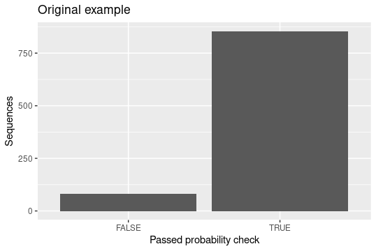
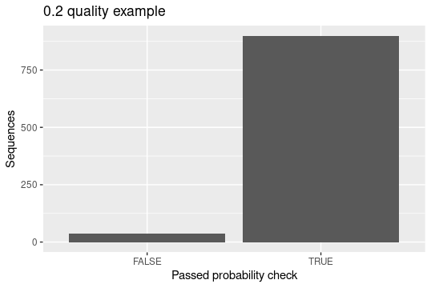
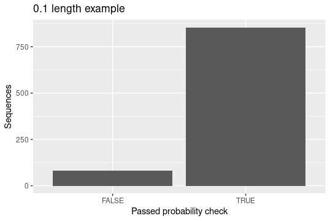
```

And between the classification

```{r out.width = '30%', echo = FALSE}

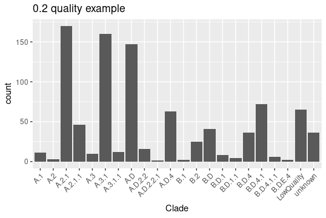
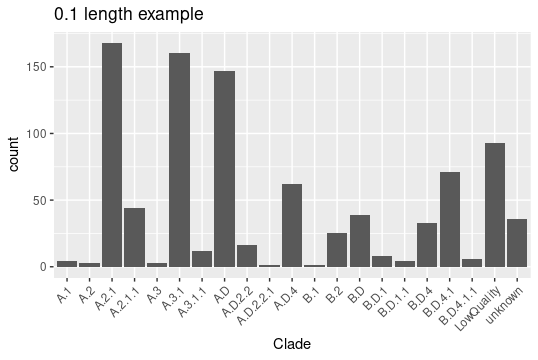
```

